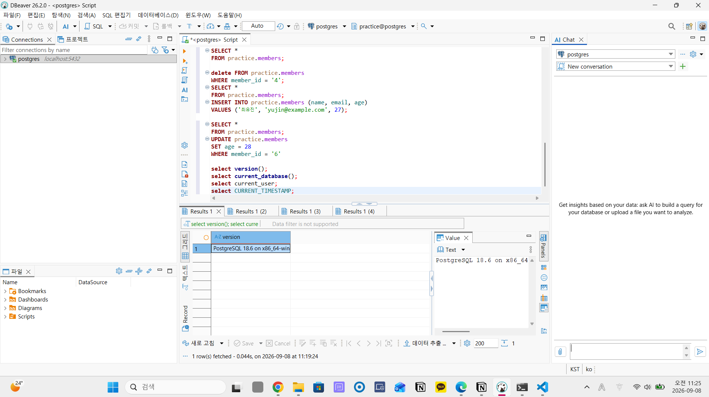
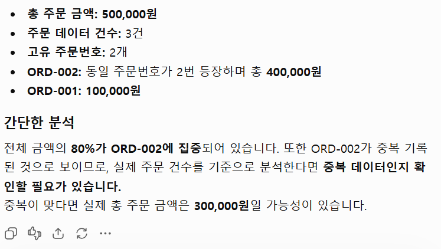
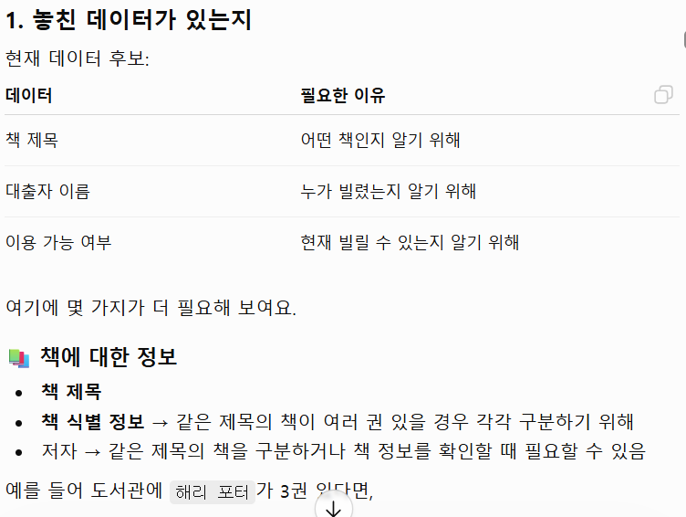

# Chapter 01 확장 실습 답안 템플릿

> **과제:** AI 시대에 데이터베이스를 왜 배워야 하는가  
> **사용 방법:** 이 파일을 내려받아 **본인의 GitHub 저장소**에 `chapter01_answer.md`라는 이름으로 저장한 뒤 답안을 작성합니다.  
> **제출 방법:** LMS에는 파일을 업로드하지 않고, **본인 GitHub 저장소의 `chapter01_answer.md` 파일 URL**을 제출합니다.

---

## 0. 학생 정보

| 항목 | 작성 내용 |
| --- | --- |
| 학번 | 2025-11211 |
| 이름 | 오한겸 |
| GitHub 계정 | hangyeom06 |
| 과제 작성일 | 2026.09.08 |
| 사용한 AI 도구 | ChatGPT |

> 실제 비밀번호, API Key, 전체 DB 접속 URL, 개인정보는 이 파일이나 캡처 화면에 기록하지 않습니다.

---

# 1. PostgreSQL 실행 환경 확인

## 1-1. 실행한 SQL

```sql
SELECT version();
SELECT current_database();
SELECT current_user;
SELECT CURRENT_TIMESTAMP;
```

## 1-2. 실행 결과 기록

```text
PostgreSQL 버전:PostgreSQL 18.6 on x86_64-windows, compiled by msvc-19.44.35228, 64-bit
현재 데이터베이스:postgres
현재 사용자:postgres
현재 시각:2026-09-08 11:29:18.247 +0900
```

## 1-3. 내가 확인한 내용

1. SQL을 작성하는 프로그램과 PostgreSQL은 같은 프로그램인가요?

```text
나의 답:아닙니다. PostgreSQL은 데이터를 관리하는 프로그램입니다.
```

2. `current_database()` 결과는 무엇을 의미하나요?

```text
나의 답:지금 데이터가 저장되는 장소를 의미합니다.
```

3. SQL이 실행되었다는 사실만으로 데이터 내용도 올바르다고 할 수 있나요?

```text
나의 답:아닙니다. 실행과정에서 의도와 다르게 실행될 수 있습니다.
```

## 1-4. 증거 화면

아래 경로에 캡처 이미지를 저장하는 것을 권장합니다.

```text
assignments/chapter01/images/step01_environment.png
```

이미지를 저장했다면 아래 링크의 파일명을 실제 파일명에 맞게 수정합니다.

```markdown

```

**이미지 삽입 위치:**

<!-- 아래 줄의 주석을 지우고 실제 이미지 Markdown을 넣어도 됩니다. -->

`여기에 STEP 1 증거 화면을 삽입하세요.`

---

# 2. Chapter 01 핵심 내용 복습

교재 문장을 그대로 복사하지 말고 자신의 말로 작성합니다.

| 본문의 핵심 | 나의 설명 |
| --- | --- |
| AI가 SQL을 만들어도 DB를 배워야 한다 | AI가 만들어주더라도 그걸 검증하고 제대로 실행했는지 확인하기 위해 DB를 배워야 한다. |
| 데이터 구조가 중요하다 | 데이터가 저장되어 있는 구조를 알아야 필요한 데이터를 찾아서 쓸 수 있다. |
| SQL 결과를 검증해야 한다 | 오류없이 실행되었다는 것이 제대로 실행되었다는 의미는 아니다. |
| 데이터 품질이 AI 답변 품질에 영향을 준다 | 데이터에 오류가 있으면 AI 답변에도 오류가 생길 수 있다. |
| 저장 방식은 데이터 양만 보고 선택하지 않는다 | 데이터 양뿐만 아니라 유형이나 이 데이터의 사용목적을 고려해 저장을 해야 한다. |

## 가장 중요하다고 생각한 한 문장

```text

```실행된 것만 확인하지 말고 제대로 실행되었는지 검증이 필요하다.

---

# 3. 실행 성공과 결과 정확성의 차이

## 3-1. SQL 실행 전 예상

학생 A는 질문 2개, 학생 B는 질문 1개, 학생 C는 질문이 없습니다.

```text
전체 학생 수: ___3___ 명
전체 질문 수: ___3___ 개
질문이 있는 학생 수: ___2___ 명
질문이 없는 학생 수: ___1___ 명
```

## 3-2. 임시 테이블 생성 및 데이터 입력 완료 확인

- [ ] `ch01_students` 생성
- [ ] `ch01_questions` 생성
- [ ] 학생 3명 입력
- [ ] 질문 3건 입력
- [ ] 두 테이블의 데이터를 직접 조회

## 3-3. 잘못된 학생 수 SQL 실행 결과

실행한 SQL:

```sql
SELECT COUNT(*) AS student_count
FROM ch01_students AS s
INNER JOIN ch01_questions AS q
    ON q.student_id = s.student_id;
```

실행 결과:

```text

```3

## 3-4. JOIN 상세 결과 관찰

```text
학생 A가 나타난 행 수:2
학생 B가 나타난 행 수:1
학생 C가 나타난 행 수:
```

다음 질문에 답합니다.

### Q1. 학생 C가 왜 결과에서 사라졌나요?

```text

```질문과 학생을 대응시켜서 학생 수를 세었기 때문이다.

### Q2. 학생 A가 왜 여러 행으로 나타났나요?

```text
질문을 2개 했기 때문이다.
```

### Q3. 위 `COUNT(*)`가 실제로 세고 있었던 것은 무엇인가요?

```text
질문의 수
```

### Q4. 결과 숫자가 우연히 실제 학생 수와 같아도 바로 믿으면 안 되는 이유는 무엇인가요?

```text
중간 과정이 잘못되어서 잘못된 답인데 우연히 같을 수 있기 때문이다.
```

## 3-5. 질문 한 건을 추가한 뒤 다시 실행

추가한 데이터:

```text
(104, 1, '네 번째 질문')
```

다시 실행한 결과:

```text
AI SQL 결과:4
실제 학생 수:3
```

### 결과 해석

```text
데이터가 바뀐 뒤 무엇이 달라졌는지: 질문 수가 달라졌다.

실제 학생 수는 왜 그대로인지: student_id가 중복이기 때문이다.

이 실험을 통해 알게 된 점: 결과가 옳다고 과정이 옳은 것은 아니다.
```

## 3-6. 학생 테이블을 직접 센 결과

```sql
SELECT COUNT(*) AS student_count
FROM ch01_students;
```

결과:

```text
3
```

### 두 SQL의 차이를 내 말로 설명

```text
첫 번째 SQL은 _________________________질문수_______________________을 세고 있었다.

두 번째 SQL은 __________________________student_id______________________을 세고 있었다.

따라서 SQL을 검토할 때는 문법보다 먼저
_____________________현재 목적을 위해 올바른 과정으로 답을 도출해내는지_________________________________________을 확인해야 한다.
```

## 3-7. 증거 화면

권장 경로:

```text
assignments/chapter01/images/step03_join_result.png
```

`여기에 STEP 3 핵심 증거 화면을 삽입하세요.`

---

# 4. 잘못된 데이터가 결과를 바꾸는 과정

## 4-1. 주문 데이터 확인

다음 데이터를 입력한 뒤 실제 결과를 확인합니다.

```text
ORD-001, 100000
ORD-002, 200000
ORD-002, 200000
```

## 4-2. 실행 전 예상

업무적으로 주문이 `ORD-001`, `ORD-002` 두 건이고 `order_code`가 주문을 고유하게 구분한다고 **가정할 경우** 예상 합계:

```text
______300,000____ 원
```

> 위 가정 자체가 실제 업무 규칙인지 확인해야 한다는 점도 기억합니다.

## 4-3. SQL 합계

```sql
SELECT SUM(amount) AS total_amount
FROM ch01_orders;
```

실제 결과:

```text
_____500,000_____ 원
```

## 4-4. 결과 해석

### `SUM` 문법 자체가 잘못된 것인가요?

```text

```아니오.

### 결과 차이의 원인은 무엇인가요?

```text

```order_code가 같으면 같은 주문으로 인식한다는 내용이 없다.

### SQL이 정확하게 실행되어도 업무 숫자가 잘못될 수 있는 이유를 설명하세요.

```text
애초에 원하는 것과 다른 목적의 실행방식으로 실행하였기 때문입니다.
```

## 4-5. AI에게 같은 데이터를 분석시킨 결과

AI가 계산한 합계:

```text
500,000
```

AI가 중복 가능성을 언급했나요?

```text
네.
```

AI가 `ORD-002` 두 행이 실제 두 주문인지 중복 입력인지 스스로 확정할 수 있나요? 이유도 적으세요.

```text
없습니다. order_code가 같으면 중복주문으로 확정하라는 명령은 없었기 때문입니다.
```

추가로 확인해야 할 업무 규칙:

```text
1. order_code가 같으면 중복주문이다.
2. 중복주문일 경우 그 중 하나만 합계에 포함시킨다.
3.
```

내가 최종적으로 내린 판단:

```text
여러 상황들에 대한 규칙을 정해주어야 원하는 목적대로 결과를 얻을 수 있다.
```

## 4-6. 증거 화면

권장 경로:

```text
assignments/chapter01/images/step04_duplicate_result.png
```

`여기에 STEP 4 핵심 증거 화면을 삽입하세요.`

---

# 5. 파일·스프레드시트·DBMS 선택 연습

각 사례에 대해 **AI에게 묻기 전에 먼저 본인의 판단을 작성**합니다.

## 사례 A. 개인 독서 기록

```text
나의 선택:스프레드시트
선택 이유: 혼자 사용하는 것이어서 파일이나 스프레드시트가 적합하지만 책 제목, 혹은 날짜에 따라 분류하거나 검색하기 편하도록 스프레드시트를 사용할 것이다.
어떤 조건이 추가되면 다른 방식으로 바꿀 것인지: 좀 더 많은 내용을 담고 읽을 책들을 체계적으로 분류하고 싶으면 DBMS를 사용할 것이다.
```

## 사례 B. 동아리 행사 신청 명단

```text
나의 선택: 스프레드시트
선택 이유: 여러 명이 3개 정도 항목의 일들을 수정하려면 스프레드시트가 적합하다고 생각한다.
어떤 조건이 추가되면 다른 방식으로 바꿀 것인지: 더 많은 인원이 동시에 작업해야 하고 관리해야하는 사항들이 더 방대해진다면 DBMS를 사용할 것이다.
```

## 사례 C. 온라인 강의 서비스

```text
나의 선택: DBMS
선택 이유: 정말 많은 사람들이 동시에 계속해서 변화하는 다양한 항목들을 수정할 수 있어야 하고 불특정 다수에게 권한이 있어야 하기 때문이다.
어떤 조건이 추가되면 다른 방식으로 바꿀 것인지: 한 사람이 관리하는 것이라면 스프레드시티를 사용해도 될 것 같다.
```

## 판단 기준 체크

- [ ] 데이터 증가
- [ ] 여러 사용자의 동시 수정
- [ ] 데이터 사이의 관계
- [ ] 반복 조회와 집계
- [ ] 정확성·일관성
- [ ] 변경 이력
- [ ] 권한 구분
- [ ] 백업·복구
- [ ] 웹·앱에서 지속 사용

### 데이터가 적으면 무조건 스프레드시트를 사용해야 하나요?

```text
나의 답:아니오. 데이터가 적어도 여러 사람이 동시에 수정하거나 계속해서 업데이트 되는 데이터를 관리하고 복잡한 분석을 필요로 한다면 DBMS가 더 좋은 선택이라고 생각합니다.
```

---

# 6. 나만의 서비스 데이터 구조 초안

> 이 내용은 이후 Chapter에서 계속 확장할 수 있으므로 신중하게 작성합니다.

## 6-1. 서비스 정의

```text
서비스 이름: 도서 대여

이 서비스는
________________도서를 대여해주고 책들의 대출 상태, 그리고 누가 대출했는지를 관리______________________________________________
하기 위한 서비스이다.
```

## 6-2. 관리할 데이터 후보

```text
1.책 제목
2. 대출자 이름
3. 이용가능 여부
4. 
5.
```

## 6-3. 한 행의 의미

| 데이터 후보 | 한 행의 의미 |
| --- | --- |
| 책 제목 | 책 제목 한 개 |
| 대출자 이름 | 현재 대출한 사람 한 명 |
| 이용가능 여부 | 대출자가 책을 대출한 기간 한 건 |

## 6-4. 관계를 자연어로 설명

```text
1. 대출자는 책을 2권까지 빌릴 수 있다.
2. 대출은 일주일동안 유효하다.
3. 대출 기간동안은 다른 사람이 책을 빌릴 수 없다.
```

## 6-5. 아직 결정하지 않은 정책

```text
Q1. 대출 기한을 연장할 수 있는가
Q2. 대출 중인 책을 다른 사람이 예약할 수 있는가
Q3. 같은 제목의 책, 혹은 동명이인은 어떻게 관리할 것인가
```

> 확정되지 않은 정책을 AI가 임의로 결정한 경우 그대로 받아들이지 않습니다.

---

# 7. AI를 검토자로 활용하기

## 7-1. 내가 AI에게 전달한 핵심 프롬프트

개인정보나 비밀번호 등 민감한 내용은 제거한 뒤 기록합니다.

```text

```

## 7-2. AI의 주요 제안과 나의 판단

최소 5개를 작성합니다.

| AI의 제안 | 수용 / 수정 / 거절 | 나의 판단 근거 |
| --- | --- | --- |
| 대출일, 반납 예정일, 실제 반납일, 현재 대출 여부 | 수용 | 그냥 대출 중이라고만 하면 언제 이 책이 반납되어야 하는지 관리하기 힘들어진다. |
| 이용가능여부 | 수정 | 이용불가능한 이유가 대출중이어서인지 책에 문제가 있어서인지 등등 이유를 알 수 없기 때문에 대출상태 데이터에서 가져오는 것에 문제가 있다. |
| DBMS 사용 적합 | 수용 | 여러가지 책, 대출자, 기록들을 체계적으로 관리하기에 적합하다. |
| 책 2권 대출 상태에서 다른 책 대출 불가 | 수용 | 이렇게 처리해야 오류가 없을 듯하다. |
|  |  |  |

## 7-3. AI에게 자기 답변을 다시 비판하도록 요청한 결과

첫 번째 답변과 달라진 점:

```text
책을 구분할 수 있는 정보를 반드시 추가하지는 않아도 된다. 같은 제목의 책을 개별적으로 구분해야 하는가라는 질문으로 남긴다.대출자를 구분할 수 있는 정보를 추가해야하지만 여러 정보 중 무엇을 사용할지는 나중에 적합한 방식으로 해야한다. 대출자 이름이 누구나 볼 수 있는 화면에 포함되면 개인정보 노출 문제가 발생할 수 있다.
```

AI가 처음에 임의로 가정했던 내용:

```text
같은 제목이 책이 여러 권 존재할 것이다. 반납 예정일이 필요한 데이터일 것이다. 등 필요할 것 같다는 이유만으로 필요한 데이터의 종류를 확장했다.
```

추가로 업무 담당자에게 확인해야 한다고 판단한 내용:

```text
동일 제목의 책이 여러 권 존재하는가. 대출자를 이름만으로 구분할 수 있는가. 동명이인은 어떻게 구분하는가. 별도의 회원 개념이 있는가. 대출 기간 1주일을 어떻게 계산하는가. 반납일의 기록 필요가 있는가. 연체가 발생하면 어떻게 처리하는가.
```

## 7-4. AI 활용에 대한 나의 평가

```text
가장 유용했던 부분: 대출일과 반납예정일 등의 데이터 항목을 추가해야한다.

수정하거나 거절한 부분: 이용가능 여부는 대출 혹은 연체중인지, 또는 책 사용이 불가능한 상태인지로 나눠서 정리

그렇게 판단한 근거:AI는 여러 사유가 있을 수 있으니 대출가능여부를 대출상태만으로 확인할 수 없다고 했고 이용가능 여부 판단은 대출여부와 책사용가능여부로 확인할 수 있다고 생각해 이렇게 수정하였다.

AI가 없었다면 놓쳤을 가능성이 있는 질문:대출일과 반납예정일을 기록하고 연체에 대한 규칙을 정하는 것.
```

## 7-5. AI 활용 증거 화면

권장 경로:

```text
assignments/chapter01/images/step07_ai_review.png
```

AI 대화 전체를 캡처할 필요는 없습니다. 핵심 요청과 검토 과정이 보이는 화면 1장 정도면 충분합니다.

`여기에 AI 활용 증거 화면을 삽입하세요.`

---

# 8. 기준 데이터·파생 데이터·AI 생성 결과 구분

내 서비스에 맞게 작성합니다.

| 구분 | 내 서비스의 예 | 판단 이유 |
| --- | --- | --- |
| 기준 데이터 | 도서대출기록 | 도서 대여 서비스이니 도서대출기록이 기준 데이터가 되어야 한다. |
| 파생 데이터 | 도서별 대출 횟수 | 도서마다 몇 회 대출되었는지를 기준 데이터에서 알아낼 수 있다. |
| AI 생성 결과 | 인기도서 분석 | 도서의 대출 횟수를 통해 인기도서를 분석할 수 있다. |

### 기준 데이터가 변경되면 파생 데이터는 어떻게 해야 하나요?

```text
기준 데이터의 변경 내역을 파생 데이터에도 업데이트 하거나 그러기 힘든 경우 사용하지 않아야 한다.
```

### AI 결과만 있고 원본 데이터가 없다면 결과를 충분히 검증할 수 있나요?

```text
검증하기 힘들다. AI가 분석을 제대로 했는지, 제대로 된 데이터를 사용했는지 대조할 데이터가 아예 존재하지 않기 때문이다.
```

---

# 9. 최종 성찰

아래 세 문장은 반드시 **본인의 말**로 작성합니다.

```text
1. SQL이 실행되어도 결과를 바로 믿으면 안 되는 이유는
   그 과정이 내가 원하는 결과를 만드는데에 적합하지 않을 수 있고 오류가 있지만 결과가 나왔을 수 있기 떄문이다.

2. AI를 데이터베이스 학습에 활용할 때 가장 중요한 것은
   AI가 제대로 된 데이터를 사용했는지 확인해야 하고 오류는 없는지 다시 검증을 하는 것이 중요한 것이다.

3. 이번 실습 이후 내가 더 확인하고 싶은 것은
   DBMS에서 AI를 어떻게 활용할 수 있는지 더 구체적인 예시들을 확인하고 적용해보고 싶다.
```

## 이번 Chapter에서 새롭게 알게 된 점 3가지

```text
1. SQL의 결과가 올바르다고 해서 과정이 올바른 것은 아니다.
2. AI의 활용에는 검증이 필수이다.
3. PostgreSQL은 데이터들을 관리할 수 있게 도와주는 프로그램이다.
```

## 아직 이해가 명확하지 않은 부분

```text
1. 데이터의 오류를 바로잡는 방법, 혹은 규칙에 대해 알아보고 싶다.
2.
```

---

# 10. 제출 전 자기 점검

- [ ] PostgreSQL 실행 화면을 확인했다.
- [ ] SQL 실행 전에 예상 결과를 먼저 작성했다.
- [ ] `INNER JOIN` 예제에서 누락과 반복을 설명할 수 있다.
- [ ] 숫자가 우연히 같아도 의미가 다를 수 있음을 설명했다.
- [ ] 중복 데이터가 집계 결과에 미치는 영향을 확인했다.
- [ ] 저장 방식을 데이터 양만으로 판단하지 않았다.
- [ ] 개인 서비스 주제를 하나 정했다.
- [ ] 데이터 후보와 한 행의 의미를 작성했다.
- [ ] 미확정 정책을 최소 3개 작성했다.
- [ ] AI 제안을 수용·수정·거절로 구분했다.
- [ ] AI 제안에 대한 판단 근거를 작성했다.
- [ ] 기준 데이터·파생 데이터·AI 결과를 구분했다.
- [ ] 핵심 증거 이미지가 Markdown에서 정상적으로 보인다.
- [ ] 비밀번호·API Key·개인정보가 노출되지 않았다.

---

# 11. LMS 제출 정보

## 내 GitHub 답안 파일 URL

아래에는 **교수자 템플릿 URL이 아니라 본인이 작성한 답안 파일의 GitHub URL**을 기록합니다.

```text
https://github.com/<본인-GitHub-ID>/<본인-저장소>/blob/main/assignments/chapter01/chapter01_answer.md
```

내 실제 제출 URL:

```text

```

> LMS에는 위 **본인 저장소의 `chapter01_answer.md` 파일 URL 하나**를 제출합니다.

---

## 권장 학생 저장소 구조

```text
<본인-저장소>/
└── assignments/
    └── chapter01/
        ├── chapter01_answer.md
        └── images/
            ├── step01_environment.png
            ├── step03_join_result.png
            ├── step04_duplicate_result.png
            └── step07_ai_review.png
```

이 구조를 사용하면 이후 Chapter 02, Chapter 03도 같은 방식으로 계속 추가할 수 있습니다.
