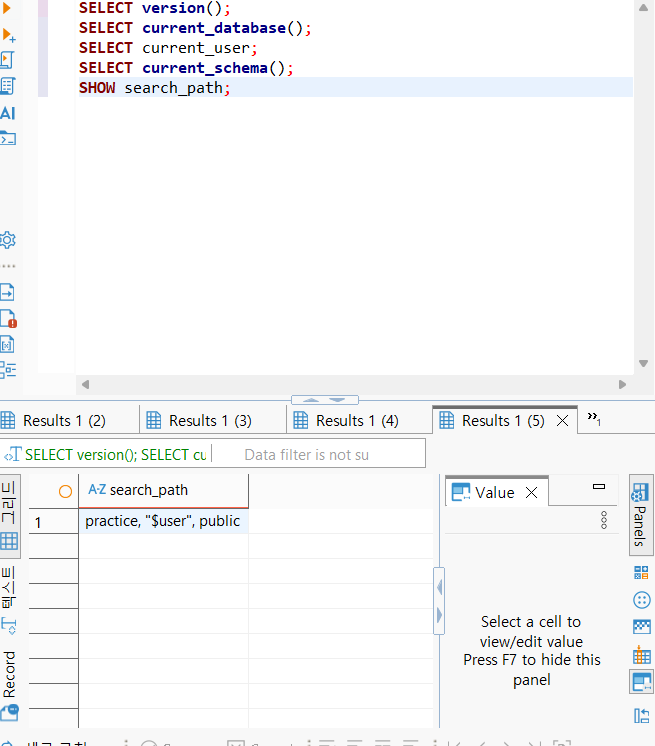
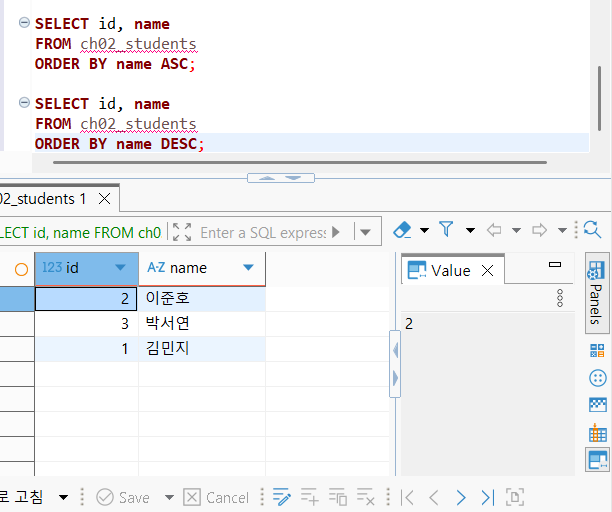
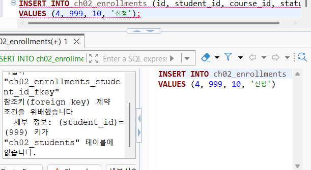
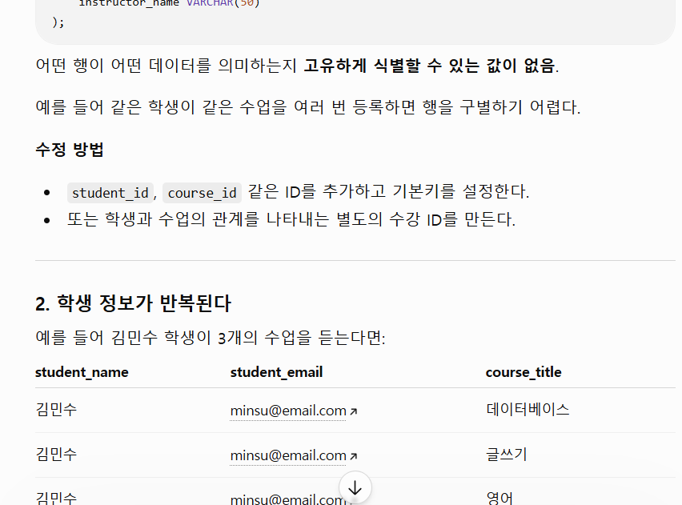

# Chapter 02 확장 실습 답안 템플릿

> **과제:** 데이터와 DBMS의 기본 개념  
> **사용 방법:** 이 파일을 내려받아 본인의 GitHub 저장소에 `chapter02_answer.md`라는 이름으로 저장한 뒤 실습하면서 바로 작성합니다.  
> **제출 방법:** LMS에는 파일을 직접 업로드하지 않고, **본인 GitHub 저장소의 `chapter02_answer.md` 파일 URL**을 제출합니다.

---

## 제출 전 개인정보 주의

LMS에서 제출자를 확인할 수 있으므로 이 공개 Markdown 파일에 학번이나 실명을 반드시 적을 필요는 없습니다.

```text
GitHub 계정 또는 별칭:hangyeom06
과제 작성일:2026.09.13
사용한 AI 도구:CHATGPT
```

> 실제 비밀번호, API Key, 전체 DB 접속 URL, 개인정보가 포함된 화면은 올리지 않습니다.

---

# 1. PostgreSQL에서 현재 위치 확인

## 1-1. 실행한 SQL

```sql
SELECT version();
SELECT current_database();
SELECT current_user;
SELECT current_schema();
SHOW search_path;
```

## 1-2. 실행 결과 기록

```text
PostgreSQL 버전:PostgreSQL 18.6 on x86_64-windows, compiled by msvc-19.44.35228, 64-bit
현재 데이터베이스:postgres
현재 사용자:postgres
현재 스키마:practice
search_path:practice, "$user", public
```

## 1-3. 구조를 내 말로 설명

```text
PostgreSQL은: 데이터를 저장하고 관리하는 시스템이다.

현재 접속한 데이터베이스는:postgres이다.

스키마는:데이터베이스 안에서 테이블 같이 구분해서 관리하는 공간이다.

DBeaver 또는 psql 같은 도구는:postgreSQL에서 데이터를 확인하거나 명령어를 실행할 수 있게 하는 도구이다.
```

## 1-4. 계층 구조 완성

```text
사용자
→ DBeaver
→ PostgreSQL DBMS
→ 데이터베이스
→ 스키마
→ 테이블
→ 행 / 열
```

## 1-5. 증거 화면

권장 경로:

```text
assignments/chapter02/images/step01_environment.png
```

```markdown

```

`여기에 STEP 1 핵심 증거 화면을 삽입하세요.`

---

# 2. 데이터베이스 안의 스키마와 테이블 관찰

## 2-1. 스키마 조회 결과

실행한 SQL:

```sql
SELECT schema_name
FROM information_schema.schemata
ORDER BY schema_name;
```

관찰한 스키마 이름 중 3개 이내를 적습니다.

```text
1.information_schema
2.pg_catalog
3.pg_temp_6
```

### `public`은 무엇인가요?

```text
나의 설명:스키마. 데이터 정리하는 공간
```

### 데이터베이스와 스키마는 같은 것인가요?

```text
나의 설명:아니다. 데이터베이스 안에 여러 개의 스키마가 존재할 수 있다.
```

## 2-2. 현재 보이는 테이블 조회

```sql
SELECT table_schema, table_name
FROM information_schema.tables
WHERE table_type = 'BASE TABLE'
  AND table_schema NOT IN ('pg_catalog', 'information_schema')
ORDER BY table_schema, table_name;
```

```text
조회된 사용자 테이블 수 또는 눈에 띈 테이블:members

아직 테이블이 거의 없어도 괜찮은 이유: 데이터가 있다면 테이블은 나중에 쉽게 생성가능하기 때문이다.
```

## 2-3. 관찰 정리

```text
PostgreSQL 서버 안에는 여러 데이터베이스가 있을 수 있다.
한 데이터베이스 안에는 여러 스키마가 있을 수 있다.
스키마 안에는 테이블과 같은 객체가 존재한다.
```

---

# 3. TEMP TABLE로 테이블·행·열·키 직접 확인

## 3-1. 임시 테이블 생성 완료 확인

- [ ] `ch02_students` 생성
- [ ] `ch02_courses` 생성
- [ ] `ch02_enrollments` 생성

각 테이블의 **한 행 의미**를 적습니다.

| 테이블 | 한 행의 의미 |
| --- | --- |
| `ch02_students` | 학생 한 명 |
| `ch02_courses` | 강의 한 개 |
| `ch02_enrollments` | 강의 수강 신청 여부 하나|

## 3-2. 열의 의미 확인

### `ch02_students`

| 열 | 값의 의미 | 내부 식별자 / 업무 식별자 / 일반 속성 |
| --- | --- | --- |
| `id` | 학생을 데이터베이스에서 구분하기 위한 번호 | 내부 식별자 |
| `student_number` | 학생의 학번 | 업무 식별자 |
| `name` | 학생 이름 | 일반 속성 |
| `major` | 학생 전공 | 일반 속성 |

### `ch02_enrollments`

| 열 | 값의 의미 | PK / FK / 일반 속성 |
| --- | --- | --- |
| `id` | 수강정보 구분하기 위한 번호 | PK |
| `student_id` | 어떤 학생의 수강 정보인지 알 수 있는 번호 | FK |
| `course_id` | 어떤 강의의 수강 정보인지 나타내는 번호 | FK |
| `status` | 수강 상태 | 일반 속성 |

## 3-3. 입력된 행 수

```text
students 행 수: 학생 수
courses 행 수: 강의 수
enrollments 행 수: 강의 수강 여부 수
```

## 3-4. 내부 식별자와 업무 식별자

```text
students.id가 필요한 이유:데이터베이스에서 서로 다른 학생들을 구분하기 위해서 이다.

student_number가 필요한 이유: 외부에서 학생을 구분하는 요소이기 때문이다.

둘을 항상 같은 값으로 사용하지 않아도 되는 이유:students.id는 데이터베이스 내부에서 사용하는 식별자이고 student_number은 외부에서 사용하는 식별자이기 때문이다.
```

## 3-5. 숫자처럼 보이는 학번을 문자열로 저장한 이유

```text
나의 설명:학번의 맨 앞자리가 0일 수도 있고 계산을 위한 값이 아니기 때문이다.
```

---

# 4. 테이블과 조회 결과는 다르다

## 4-1. 원본 테이블 행 수

```text
ch02_students 전체 행 수: 3
```

## 4-2. 일부 열만 조회

실행 SQL:

```sql
SELECT name, major
FROM ch02_students
ORDER BY id;
```

```text
원본 테이블의 열 수와 조회 결과의 열 수가 다른 이유: 여러 개의 열 중에 2개만 지정해서 조회했기 때문이다.
```

## 4-3. 조건을 적용한 조회

실행 SQL:

```sql
SELECT id, student_number, name, major
FROM ch02_students
WHERE major = '컴퓨터공학'
ORDER BY id;
```

```text
원본 테이블 행 수:3
조회 결과 행 수:1
원본 테이블의 데이터가 삭제된 것인가?:아니오
그렇게 판단한 이유:그냥 조건에 따라 조회한 것이기 때문이다.
```

## 4-4. 정렬 결과 비교

```sql
SELECT id, name
FROM ch02_students
ORDER BY name ASC;

SELECT id, name
FROM ch02_students
ORDER BY name DESC;
```

```text
ASC 결과의 첫 학생: 김민지
DESC 결과의 첫 학생: 이준호

이 실험을 통해 ORDER BY에 대해 알게 된 점:특정 열을 기준으로 오름차순 또는 내림차순으로 결과를 정렬할 수 있다.
```

## 4-5. 증거 화면

권장 경로:

```text
assignments/chapter02/images/step04_result_set.png
```

`여기에 STEP 4 핵심 증거 화면을 삽입하세요.`

---

# 5. PK와 FK를 실제로 관찰

## 5-1. 정상 데이터의 관계 읽기

다음 SQL 결과를 보고 작성합니다.

```sql
SELECT
    e.id AS enrollment_id,
    s.name AS student_name,
    c.title AS course_title,
    e.status
FROM ch02_enrollments AS e
JOIN ch02_students AS s
    ON s.id = e.student_id
JOIN ch02_courses AS c
    ON c.id = e.course_id
ORDER BY e.id;
```

```text
한 행이 의미하는 것: 한 학생이 하나의 강의를 수강하는 하나의 수강 정보

같은 student_id가 여러 enrollment 행에서 반복될 수 있는 이유: 한 학생이 여러 강의를 수강할 수 있기 때문이다.

같은 course_id가 여러 enrollment 행에서 반복될 수 있는 이유:하나의 강의를 여러 학생이 수강할 수 있기 때문이다.
```

## 5-2. 기본키 중복 오류 관찰

중복 PK 입력을 시도한 결과:

```text
실행 성공 / 실패: 실패
오류 메시지에서 확인한 핵심 단어:중복된 키 값
왜 실패했다고 생각하는가: 이미 있는 키 값을 사용했기 때문이다.
```

## 5-3. 존재하지 않는 학생을 참조하는 FK 오류 관찰

존재하지 않는 `student_id`를 사용한 수강신청 입력 결과:

```text
실행 성공 / 실패:실패
오류 메시지에서 확인한 핵심 단어:테이블에 없습니다
왜 실패했다고 생각하는가:테이블에 없는 데이터를 사용하려고 했기 때문이다.
```

## 5-4. PK와 FK의 차이 정리

```text
PK는 각각의 행을 고유하게 식별 하기 위한 키이다.

FK는 다른 테이블의 데이터를 참조 하기 위한 키이다.

FK 값이 여러 행에서 반복될 수 있는 이유는
하나의 학생이나 강의가 여러 가지 수강 정보와 연결 가능하기 때문이다.
```

## 5-5. 증거 화면

권장 경로:

```text
assignments/chapter02/images/step05_pk_fk.png
```

> 오류 메시지는 전체 화면이 아니라 테이블명·constraint·참조 오류가 보이는 정도만 캡처합니다.

`여기에 STEP 5 핵심 증거 화면을 삽입하세요.`

---

# 6. 관계와 카디널리티를 자연어로 설명

현재 임시 데이터 기준으로 작성합니다.

```text
학생 한 명은 여러 수강신청을 가질 수 있는가?: 가질 수 있다.

강의 한 개는 여러 수강신청을 가질 수 있는가?: 가질 수 있다.

수강신청 한 건은 학생 몇 명을 참조하는가?: 1개

수강신청 한 건은 강의 몇 개를 참조하는가?:1개
```

아래 구조를 완성합니다.

```text
students 1 ── N enrollments N ── 1 courses
```

### 학생과 강의가 N:M 관계라고 볼 수 있는 이유

```text
나의 설명:학생이 여러 개의 강의를 신청할 수 있고 강의 하나를 신청하는 학생도 여러 명이므로 N:M 관계가 성립한다.
```

> 아직 0개 허용 여부, 필수 관계, 삭제 정책까지 확정하지 않습니다. 그런 규칙은 Chapter 05~06에서 다룹니다.

---

# 7. AI가 만든 테이블 구조 직접 검토

## 7-1. AI에게 묻기 전에 내가 먼저 찾은 문제

다음 구조를 보고 최소 4개를 적습니다.

```sql
CREATE TABLE student_courses (
    student_name VARCHAR(50),
    student_email VARCHAR(100),
    course_title VARCHAR(100),
    instructor_name VARCHAR(50)
);
```

```text
문제 1. 같은 학생이 여러 개의 강의를 수강하면 학생 정보 반복
문제 2. 같은 강의를 여러 명의 학생이 수강하면 학생 정보 반복
문제 3. 같은 학생이나 강의 정보가 중복 입력될 가능성
문제 4. 정보를 수정할 때 여러 개의 행을 수정해야 함
```

## 7-2. AI 검토 요청 프롬프트

사용한 핵심 프롬프트를 기록합니다.

```text
이 구조의 문제점을 정리해줘. 수정방안도 함께.
```

## 7-3. AI 제안과 나의 판단

| AI의 지적 또는 제안 | 동의 / 수정 / 보류 | 나의 근거 |
| --- | --- | --- |
| student_id 같은 아이디를 추가하고 기본키를 설정 | 동의 | 각 행을 식별할 수 있는 값 없음 |
| 학생 정보와 수업 정보를 별도 테이블로 분리 | 동의 | 학생 수, 강의 수가 늘어나면 중복 데이터 증가 |
| 이메일 중복 금지 조항 추가 | 동의 | 학생마다 이메일이 하나이고 중복되면 안된다 |
|  |  |  |
|  |  |  |

## 7-4. 본문과 대조한 항목

AI 설명 중 최소 하나를 `chapter02.md`와 비교합니다.

```text
AI가 설명한 내용:어떤 행이 어떤 데이터를 의미하는지 고유하게 식별할 수 있는 값이 없다

본문에서 확인한 내용: 여러 학생이 여러 강의를 들을 때 학생 및 강의 정보가 반복될 수 있다.

일치 / 부분 일치 / 수정 필요: 부분 일치

내가 최종적으로 이해한 내용: 데이터의 중복을 막고 식별하여 정리하기 위해서는 데이터를 분류하고 기본키를 설정하는 것이 중요하다
```

## 7-5. 증거 화면

권장 경로:

```text
assignments/chapter02/images/step07_ai_review.png
```

`여기에 AI 검토 과정의 핵심 화면을 삽입하세요.`

---

# 8. Chapter 01의 개인 서비스 아이디어를 DB 용어로 다시 표현

Chapter 01에서 정한 개인 서비스 주제를 그대로 사용하거나 새 주제를 정해도 됩니다.

## 8-1. 서비스 기본 정보

```text
서비스 이름:도서 대여 서비스
서비스 목적:도서 대여 및 관리
```

## 8-2. PostgreSQL 구조 후보

```text
데이터베이스 이름 후보:library_db
스키마 이름 후보: library
```

> 아직 실제 데이터베이스나 스키마를 생성하지 않아도 됩니다.

## 8-3. 테이블 후보와 한 행 의미

최소 3개를 작성합니다.

| 테이블 후보 | 한 행의 의미 | 내부 ID 후보 | 업무 식별자 후보 |
| --- | --- | --- | --- |
| books | 책 한 권 | book_id | ISBN |
| members | 회원 한 명 | member_id | 회원번호 |
| rentals | 대출/반납 이력 한 건 | rental_id | 대출시간&회원번호 |

## 8-4. FK 후보

```text
1. rentals.member_id → members.member_id
   이유: 어떤 회원이 대출한 것인지 나타내기 위해서

2. rentals.book_id → books.book_id
   이유: 어떤 책을 대출한 것인지 나타내기 위해서
```

## 8-5. 자연어 관계 문장

```text
1. 한 명의 회원은 2권의 책을 대출할 수 있다.
2. 한 권의 책은 반납되기 전까지 다시 대출될 수 없다.
3. 하나의 대출 기록은 한 명의 회원, 한 권의 책에 연결된다.
```

## 8-6. 아직 확정하지 않을 정책

```text
Q1. 대출한 책의 대출 기간은 몇 일이고 기준은 무엇인가
Q2. 대출 기록에서 반납일을 기록할 것인지, 그리고 반납하지 않은 경우는 어떻게 표시할지
Q3. 같은 책을 여러 권 보유하고 있을 때 어떻게 지정해서 관리할지
```

---

# 9. AI를 개인 구조의 검토자로 사용

## 9-1. 사용한 프롬프트

```text
내가 만들 서비스의 토대야. 내가 쓴 내용을 검토해줘.
```

## 9-2. AI가 질문한 내용 중 유용했던 것

```text
1. rentals의 대출시간&회원번호는 업무 식별자라고 보기 애매하지 않은가
2. 대출 가능한 책의 권수가 정확히 2권인지 최대 2권인지
3.
```

## 9-3. AI가 너무 빨리 결정한 내용 또는 내가 보류한 내용

```text
1. 대출 기간 계산 기준과 대출기간을 몇 일로 할지
2. 같은 ISBN의 책을 여러 권 보유하는 경우 어떻게 관리할지
```

## 9-4. 검토 후 수정한 구조

| 수정 전 | 수정 후 | 수정 이유 |
| --- | --- | --- |
| 업무 식별자 '대출시간&회원번호' |  | 굳이 만들 필요가 없어 비워놓는다 |
| 한 명의 회원은 2권의 책을 대출할 수 있다 | 한 명의 회원은 최대 2권의 책을 대출할 수 있다 | 책 이용권수의 범위가 명확하지 않았다 |
|  |  |  |

---

# 10. 최종 개념 정리

아래 문장을 본인의 말로 완성합니다.

```text
PostgreSQL은 데이터를 저장하고 관리할 수 있는 관리 시스템 이다.

DBeaver 또는 psql은 데이터베이스에 접속해서 SQL을 실행하고 데이터를 확인하고 관리하는 도구 이다.

데이터베이스와 스키마의 차이는 데이터를 관리하는 범위 이다.

테이블 한 행은 하나의 데이터 항목을 나타내는 것 이다.

조회 결과가 원본 테이블과 다른 이유는 조건을 걸거나 필요한 열만 선택했기 때문 이다.

내부 식별자와 업무 식별자의 차이는 식별자를 사용하는 목적 이다.

PK는 테이블의 각 행을 고유하게 식별하는 값 이다.

FK는 다른 테이블의 PK를 참조해서 두 테이블의 데이터를 연결하는 값 이다.
```

---

# 11. 이번 Chapter에서 새롭게 알게 된 점

최소 3개를 작성합니다.

```text
1. 데이터베이스와 스키마가 서로 다른 것임을 이해했다.
2. PK와 FK를 활용해 서로 다른 테이블을 연결할 수 있다는 것을 알게 되었다.
3. 테이블을 만들 때 식별할 수 있는 기준과 다른 테이블과의 관계도 생각해야 한다는 것을 알게 되었다.
```

## 아직 헷갈리는 내용

```text
1. 내부 식별자와 업무 식별자를 언제 사용하는 것인지 조금 헷갈린다.
2. 테이블을 만들 때 필요한 열들을 생각해내고 구분하는 능력이 아직 조금 부족한 거 같다.
```

## AI에게 다시 질문하고 싶은 내용

```text
데이터베이스를 설계할 때 테이블을 나누는 기준과 PK, FK를 정하는 기준을 예시를 들어서 설명해줘
```

---

# 12. 제출 전 자기 점검

- [ ] PostgreSQL에서 현재 database / schema / search_path를 확인했다.
- [ ] DBMS, database, schema, table을 구분해서 설명할 수 있다.
- [ ] TEMP TABLE 3개를 생성하고 직접 데이터를 조회했다.
- [ ] 각 테이블의 한 행 의미를 작성했다.
- [ ] 테이블과 조회 결과가 다르다는 것을 실제 SQL로 확인했다.
- [ ] `ORDER BY`를 사용하지 않으면 업무 순서를 가정하면 안 된다는 점을 이해했다.
- [ ] 내부 식별자와 업무 식별자의 차이를 설명할 수 있다.
- [ ] PK 중복 입력 실패를 직접 확인했다.
- [ ] 존재하지 않는 FK 참조 실패를 직접 확인했다.
- [ ] FK 값이 반복될 수 있는 이유를 설명할 수 있다.
- [ ] AI가 만든 테이블을 내가 먼저 검토했다.
- [ ] AI 설명 중 최소 하나를 본문과 대조했다.
- [ ] 개인 서비스의 테이블 후보를 3개 이상 작성했다.
- [ ] 개인 서비스의 FK 후보와 미확정 정책을 기록했다.
- [ ] 실제 비밀번호·API Key·민감한 접속 정보가 포함되지 않았는지 확인했다.
- [ ] 이미지 링크가 GitHub에서 정상적으로 보이는지 확인했다.

---

# 13. GitHub 제출 정보

답안 파일 권장 위치:

```text
assignments/chapter02/chapter02_answer.md
```

이미지 권장 위치:

```text
assignments/chapter02/images/
```

LMS 제출 URL 형식:

```text
https://github.com/<본인-GitHub-ID>/<본인-저장소>/blob/main/assignments/chapter02/chapter02_answer.md
```

## 최종 확인

- [ ] 위 URL을 로그아웃 상태 또는 다른 브라우저에서 열어도 확인 가능하다.
- [ ] Markdown이 정상 렌더링된다.
- [ ] 이미지가 깨지지 않는다.
- [ ] LMS에 교수자 템플릿 URL이 아니라 **내 답안 파일 URL**을 제출했다.
